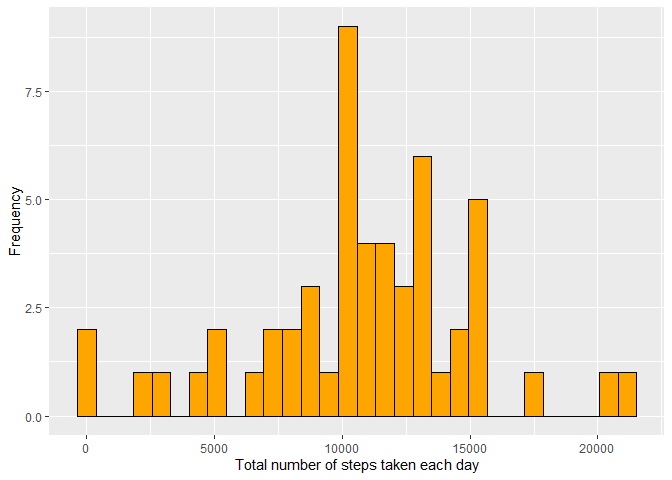
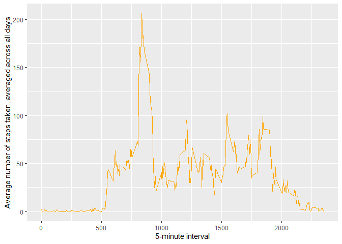
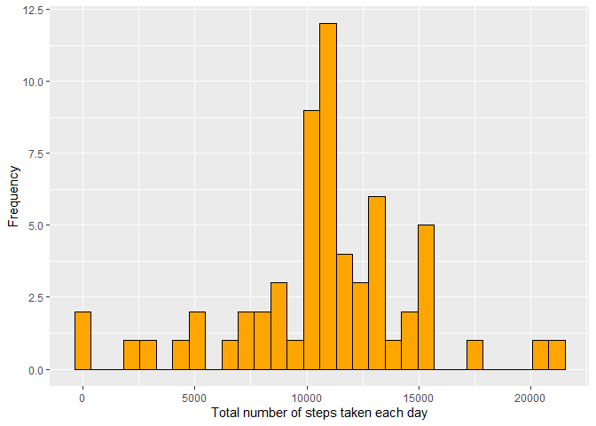
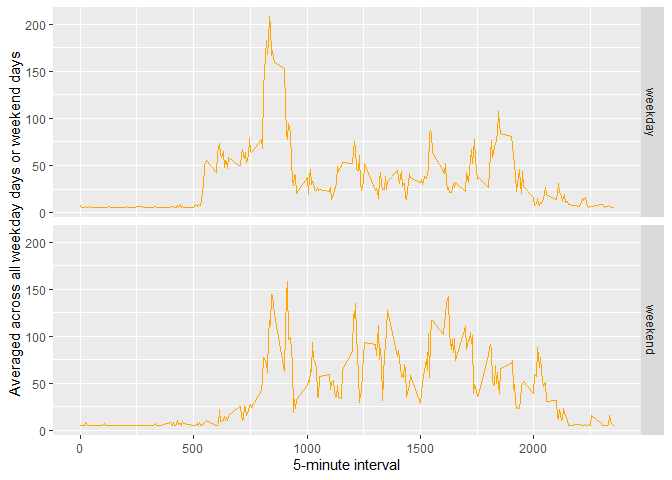

## Loading and preprocessing the data
1. Load the data (i.e. read.csv())

```r
unzip(zipfile="activity.zip")
activity <- read.csv('activity.csv')
head(activity)
```

```
##   steps       date interval
## 1    NA 2012-10-01        0
## 2    NA 2012-10-01        5
## 3    NA 2012-10-01       10
## 4    NA 2012-10-01       15
## 5    NA 2012-10-01       20
## 6    NA 2012-10-01       25
```

2. Process/transform the data (if necessary) into a format suitable for your analysis

```r
activity_Data <- na.omit(activity)
head(activity_Data)
```

```
##     steps       date interval
## 289     0 2012-10-02        0
## 290     0 2012-10-02        5
## 291     0 2012-10-02       10
## 292     0 2012-10-02       15
## 293     0 2012-10-02       20
## 294     0 2012-10-02       25
```

## What is mean total number of steps taken per day?
For this part of the assignment, you can ignore the missing values in the dataset.

1. Calculate the total number of steps taken per day

```r
# library
library(ggplot2)
```

```
## Warning: package 'ggplot2' was built under R version 4.0.2
```

```r
#steps taken per day
steps_per_day <- tapply(activity_Data$steps, activity_Data$date, sum, na.rm=TRUE)
head(steps_per_day)
```

```
## 2012-10-02 2012-10-03 2012-10-04 2012-10-05 2012-10-06 2012-10-07 
##        126      11352      12116      13294      15420      11015
```

2. If you do not understand the difference between a histogram and a barplot, research the difference between them. Make a histogram of the total number of steps taken each day

```r
qplot(steps_per_day, bins = 30, color = I("black"), fill = I("orange"),
      xlab="Total number of steps taken each day",
      ylab="Frequency")
```

<!-- -->

3. Calculate and report the mean and median of the total number of steps taken per day

```r
mean(steps_per_day)
```

```
## [1] 10766.19
```

```r
median(steps_per_day)
```

```
## [1] 10765
```

## What is the average daily activity pattern?
1. Make a time series plot (i.e. type = "l") of the 5-minute interval (x-axis) and the average number of steps taken, averaged across all days (y-axis)

```r
averages_pattern <- aggregate(x=list(steps=activity_Data$steps), by=list(interval=activity_Data$interval), mean, na.rm=TRUE)

ggplot(data=averages_pattern, aes(x=interval, y=steps)) +
        geom_line(col="orange") +
        xlab("5-minute interval") +
        ylab("Average number of steps taken, averaged across all days")
```

<!-- -->

2. Which 5-minute interval, on average across all the days in the dataset, contains the maximum number of steps?

```r
maximum_number_of_steps <- averages_pattern[which.max(averages_pattern$steps), ]
print(maximum_number_of_steps)
```

```
##     interval    steps
## 104      835 206.1698
```

## Imputing missing values
1. Calculate and report the total number of missing values in the dataset (i.e. the total number of rows with NAs)

```r
missing_values <- length(which(is.na(activity$steps)))
print(missing_values)
```

```
## [1] 2304
```
2. Devise a strategy for filling in all of the missing values in the dataset. The strategy does not need to be sophisticated. For example, you could use the mean/median for that day, or the mean for that 5-minute interval, etc.

3. Create a new dataset that is equal to the original dataset but with the missing data filled in.
I will use Impute function replace all the missing values in the dataset

```r
library(Hmisc)
```

```
## Warning: package 'Hmisc' was built under R version 4.0.2
```

```
## Loading required package: lattice
```

```
## Warning: package 'lattice' was built under R version 4.0.2
```

```
## Loading required package: survival
```

```
## Warning: package 'survival' was built under R version 4.0.2
```

```
## Loading required package: Formula
```

```
## 
## Attaching package: 'Hmisc'
```

```
## The following objects are masked from 'package:base':
## 
##     format.pval, units
```

```r
activity_filled <- activity
activity_filled$steps <- impute(activity$steps, fun=mean)
```
4. Make a histogram of the total number of steps taken each day and Calculate and report the mean and median total number of steps taken per day. Do these values differ from the estimates from the first part of the assignment? What is the impact of imputing missing data on the estimates of the total daily number of steps?

Make a histogram of the total number of steps taken each day

```r
steps_taken_per_day <- tapply(activity_filled$steps, activity_filled$date, sum)
qplot(steps_taken_per_day, bins = 30, color = I("black"), fill = I("orange"),
      xlab="Total number of steps taken each day",
      ylab="Frequency")
```

<!-- -->
Calculate and report the mean and median total number of steps taken per day

```r
mean(steps_taken_per_day)
```

```
## [1] 10766.19
```

```r
median(steps_taken_per_day)
```

```
## [1] 10766.19
```

## Are there differences in activity patterns between weekdays and weekends?
1. Create a new factor variable in the dataset with two levels – “weekday” and “weekend” indicating whether a given date is a weekday or weekend day.

```r
activity_filled$dateType <-  ifelse(as.POSIXlt(activity_filled$date)$wday %in% c(0,6), 'weekend', 'weekday')
```

2. Make a panel plot containing a time series plot (i.e. type = "l") of the 5-minute interval (x-axis) and the average number of steps taken, averaged across all weekday days or weekend days (y-axis). See the README file in the GitHub repository to see an example of what this plot should look like using simulated data.

```r
average_activity_filled <- aggregate(steps ~ interval + dateType, data=activity_filled, mean)

ggplot(average_activity_filled, aes(interval, steps)) +
        geom_line(col="orange") + facet_grid(dateType ~ .) +
        xlab("5-minute interval") + ylab("Averaged across all weekday days or weekend days ")
```

<!-- -->

